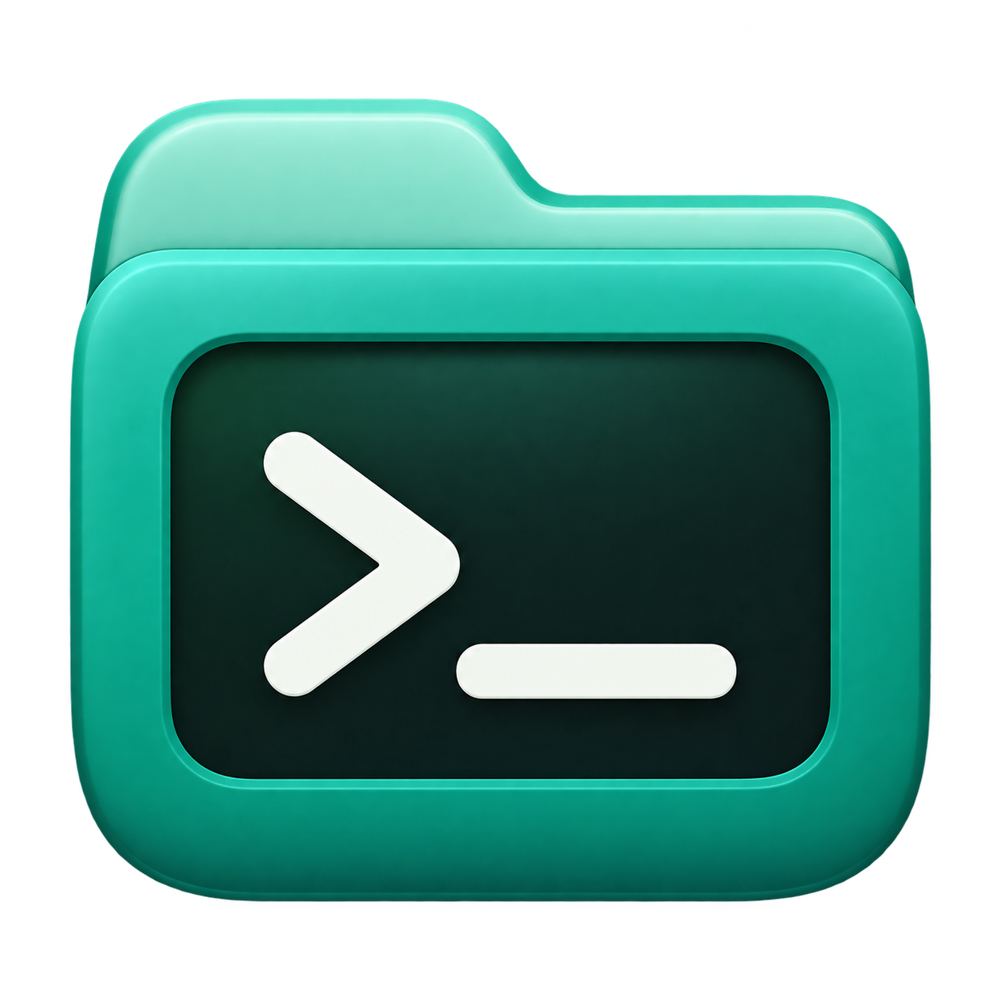
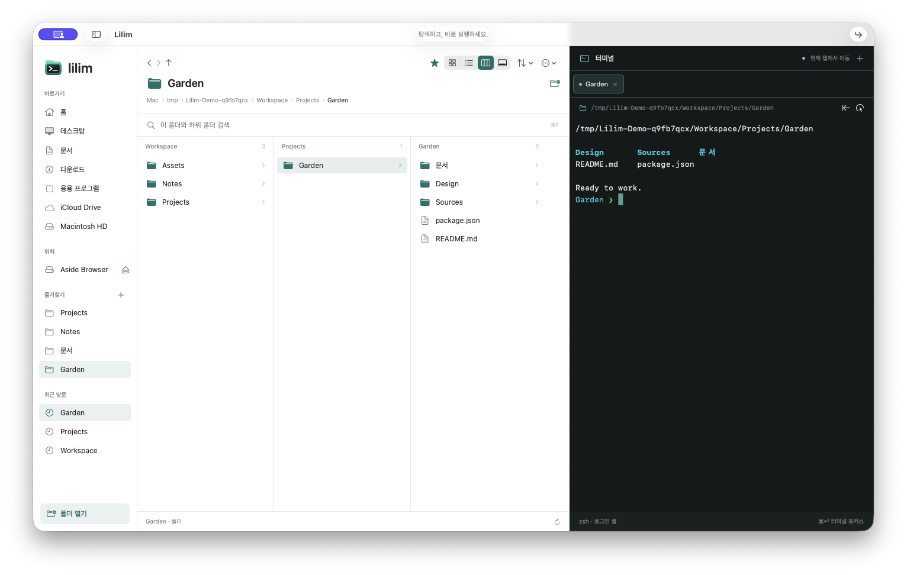
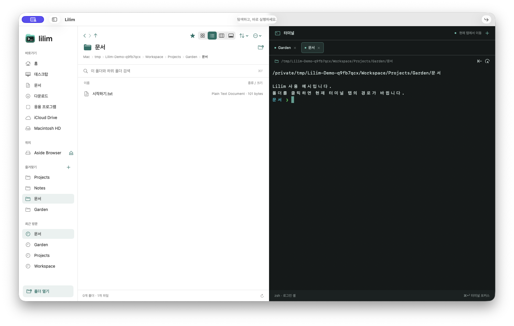
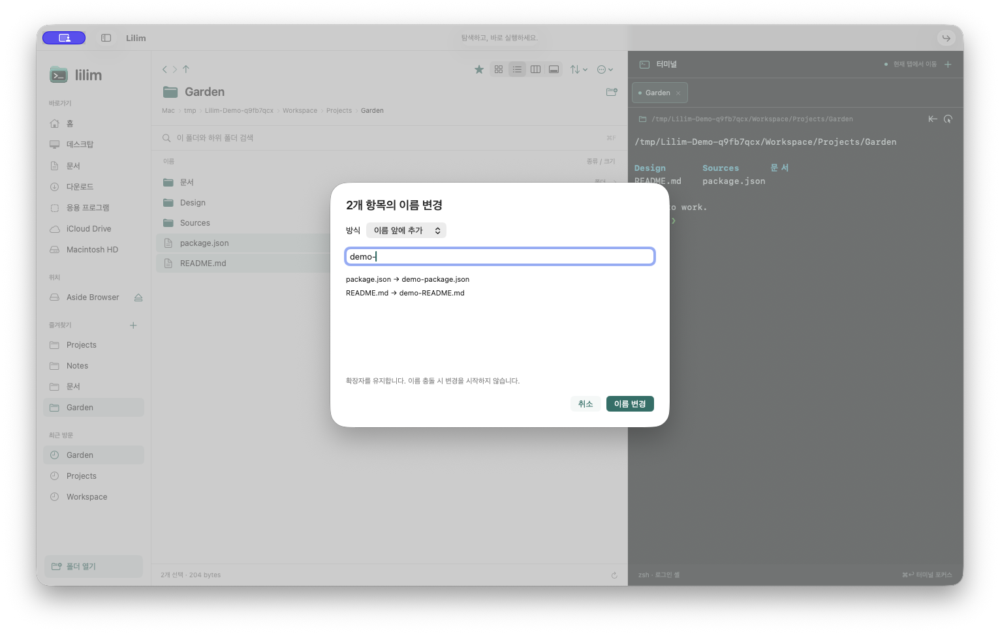
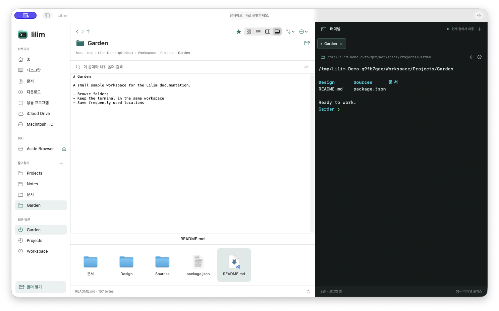

<p align="center"></p>

# Lilim

**フォルダを探して、コマンドを実行。ひとつのmacOSウィンドウで。**

[English](README.md) · [한국어](README.ko.md) · [日本語](README.ja.md)

LilimはFinder風のファイルブラウザと実際のターミナルを組み合わせたアプリです。フォルダをクリックすると、**現在のターミナルタブ**の作業ディレクトリが変わります。シェル、環境変数、出力履歴は維持されます。別のセッションが必要なときだけ、新しいタブを明示的に開きます。

SwiftUI、AppKit、ネイティブのPTYブリッジで実装し、サードパーティのパッケージには依存していません。ティールとミントのアクセントカラー、フォルダとターミナルを組み合わせたアイコンを使用しています。

**現在の状況:** 個人利用向けの初期バージョン0.1.0です。日常的に使いながら改善しています。販売とMac App Storeへの公開準備は保留中です。ソースリポジトリは公開されていますが、オープンソースライセンスはまだ選定していません。**アプリのUIは現在、韓国語です。** READMEの3言語対応は、アプリUIの3言語対応を意味しません。



`Workspace → Projects → Garden`が親子関係を示す別々のカラムに表示され、左側に保存した場所、右側にターミナルタブがひとつあります。スクリーンショットは2026年10月1日、実際のネイティブアプリでサンプルファイルを使って撮影しました。撮影用セッションのシェルプロンプトは簡略化しています。

## 目次

- [インストール](#installation)
- [移動とお気に入り](#navigation)
- [ターミナルの動作](#terminal)
- [ファイル操作とプレビュー](#files)
- [キーボードショートカット](#shortcuts)
- [現在の制限](#limits)
- [開発](#development)
- [テスト版の共有](#sharing)
- [フィードバックとライセンス](#license)

<a id="installation"></a>

## インストール

### 必要な環境

| 用途 | 条件 |
| --- | --- |
| アプリの実行 | macOS 14以降 |
| ソースからのビルド | Swift 6.2以降を提供するmacOSのCommand Line ToolsまたはXcode |
| ユニバーサルのテストZIP作成 | 完全なXcode。Apple Silicon（`arm64`）とIntel（`x86_64`）をビルド |

### ビルドと起動

```sh
git clone https://github.com/obst2580/lilimdir.git
cd lilimdir
bash scripts/build-app.sh release
```

成果物は**`dist/Lilim.app`**です。Swift Package Managerではローカルのツールチェーンに対応するアーキテクチャでビルドします。両方のMacアーキテクチャに対応するには、後述のパッケージ作成スクリプトを使います。通常のビルドには外部パッケージのインストールやXcodeプロジェクトの生成は不要です。

1. Finderでリポジトリの`dist`フォルダを開きます。
2. `Lilim.app`を**アプリケーション**フォルダに移動します。
3. インストールしたアプリをダブルクリックします。
4. Dockのアイコンを右クリックし、**オプション → Dockに追加**を選びます。

更新するときはLilimを終了し、新しいアプリに置き換えてから起動します。終了したシェルセッションは復元されません。

開発時の起動と、開始フォルダの指定:

```sh
bash scripts/run.sh
bash scripts/run.sh --directory "$PWD"
```

現在のビルドはローカルのad hoc署名のみで、Developer ID署名と公証は未実施です。別のMacではダウンロードしたテスト版の起動がブロックされる場合があります。同梱のインストール案内と[開発元が不明なアプリについてのAppleの案内](https://support.apple.com/guide/mac-help/open-a-mac-app-from-an-unknown-developer-mh40616/mac)を参照してください。

<a id="navigation"></a>

## 移動とお気に入り

| 領域 | 用途 |
| --- | --- |
| サイドバー | ホーム、デスクトップ、書類、ダウンロード、アプリケーション、利用可能なボリューム、お気に入り、最近の場所 |
| ファイルブラウザ | フォルダとファイルをアイコン、リスト、階層カラム、ギャラリーで表示 |
| ターミナル | 選択したフォルダで、現在のシェルセッションを使ってコマンドを実行 |

### フォルダを移動する

1. **フォルダを1回クリック**すると、そのフォルダに入り、現在のターミナルのディレクトリも変わります。カラム表示では次のカラムに子項目が表示されます。カラムは親子のフォルダを表し、深さは3階層に限定されません。
2. ファイルは1回クリックで選択し、ダブルクリックで既定のアプリで開きます。複数選択には`⌘`クリックや`⇧`クリックを使います。
3. パンくずリストから上位フォルダに移動できます。`⌘L` / `⌘⇧G`でパスを入力し、`⌘⇧O`でフォルダ選択ダイアログを開きます。
4. `⌘F`は現在のフォルダと子孫フォルダの名前を検索します。結果には親フォルダのパスも表示します。
5. `⌘1`〜`⌘4`で表示を切り替えます。名前、種類、サイズ、作成日、変更日、昇順/降順、フォルダ優先の並べ替えに対応しています。
6. `⌘⇧.`で隠しファイルを切り替え、`⌘R`で更新します。区切り線をドラッグして各領域の幅を調整できます。

フォルダへのシンボリックリンクもLilim内で移動します。**Finderで表示**（`Finder에서 보기`）はコンテキストメニューから明示的に選ぶ別の操作です。

### お気に入りを保存する

- ツールバーの**星**で現在のフォルダを追加・削除します。
- フォルダを右クリック → **お気に入りに追加**（`즐겨찾기에 추가`）。選択した複数のフォルダをまとめて追加できます。
- サイドバーのお気に入り見出しの**+**から、ひとつまたは複数のフォルダを選べます。現在の場所は変わりません。
- **お気に入り**（`즐겨찾기`）メニューでも追加や保存先への移動ができます。
- 保存した場所を右クリックして削除できます。同じパスの重複登録は除外されます。

お気に入りをクリックすると、ブラウザと**現在のターミナルタブ**が移動します。お気に入りと最近の場所は再起動後も残ります。現在はフラットな一覧で、独自のグループ、別名、手動での並べ替えは未実装です。

<a id="terminal"></a>

## ターミナルの動作

| 操作 | 結果 |
| --- | --- |
| フォルダ、パンくず、お気に入りをクリック | 現在のタブで移動。別のタブを作成・自動選択しない |
| **+**、`⌘T`、**新しいターミナルタブで開く**（`새 터미널 탭에서 열기`） | 独立したPTYとシェルを作成 |
| ターミナルタブを選択 | そのセッションを有効にし、ブラウザをその場所へ移動 |
| フォアグラウンドのコマンド実行中にフォルダを選択 | 最後に選択した移動先を保持し、コマンド終了後に適用 |
| ターミナルで`cd`を実行 | ターミナルのパス表示を更新。隣の矢印を押すとブラウザも移動 |
| タブを閉じる / アプリを終了 | そのセッションのシェルとジョブ / アプリ所有の全セッションを終了 |

他のタブの処理は続きます。実行可能な`$SHELL`をログインシェルとして使い、利用できない場合は`/bin/zsh`を使います。移動にはパスを引用した`builtin cd -- …`を送信するため、コマンドが画面に表示されることがあります。ブラウザから移動するときは、入力途中の未実行コマンド行を消去します。

UTF-8、ネイティブ入力方式、ANSIの色とカーソル移動、画面消去、代替画面、bracketed paste、文字選択・コピー、5,000行のスクロールバックに対応しています。macOSの分解されたハングルのフォルダ名は合成した音節として2セルで表示し、元のパスとコピーする文字列は維持します。



お気に入りから`문서`を新しいタブで開いた例です。既存の`Garden`タブを残し、実際のシェルでサンプルファイルを出力しています。

<a id="files"></a>

## ファイル操作とプレビュー

選択した項目を右クリックするか、フォルダのオプションメニューを使います。ファイル操作のショートカットは**ファイルブラウザにフォーカスがあるとき**に適用されます。ターミナルのコピー・ペーストはターミナルの入力として処理されます。

| 分類 | 機能 |
| --- | --- |
| 作成・開く | フォルダ、テキストファイル、選択項目をまとめた新規フォルダ、既定のアプリ、別のアプリで開く |
| コピー・移動 | コピー/ペースト、カット、移動ペースト、移動先選択、ドラッグ＆ドロップ |
| 名前・複製 | 個別変更、接頭辞/接尾辞/置換/連番の一括変更とプレビュー、複製 |
| 削除・復元 | システムのゴミ箱、現在のセッション内で取り消し/やり直し |
| 整理 | Finderエイリアス、ZIP作成、Finderタグの名前・色、追加/置換/削除 |
| 確認 | Quick Look、ギャラリー、ファイル情報、アクセス権とロック状態 |
| システム連携 | Finderで表示、パスのコピー、macOS共有メニュー、接続ボリュームと取り出し |

### コピー・移動・復元

- `⌘C`でコピー、`⌘V`でペースト、`⌘⌥V`でコピーした項目を移動します。`⌘X`でも移動対象として指定できます。
- 同じボリューム内へのドラッグは移動、別のボリュームへのドラッグはコピーです。Optionでコピー、Commandで移動を指定できます。
- 名前が衝突した場合は**両方を保持、置き換え、スキップ、キャンセル**を選べます。置換前の項目と削除した項目はシステムのゴミ箱に移動します。
- `⌘Z` / `⌘⇧Z`で対応する操作を取り消し・やり直しできます。外部での変更や復元先の衝突によって復元が制限されることがあります。履歴はアプリ終了時に消去されます。
- 完全削除やゴミ箱を空にする機能はありません。

詳細な実装範囲と復元条件は[Finder機能レビュー](docs/Finder-Features.md)に記録しています。この補足文書は現在、韓国語です。

### 名前変更とプレビュー

複数項目を選んでReturnを押すと一括名前変更を開きます。適用前に変更前/後の名前を確認できます。拡張子は維持され、変更先の名前が衝突する場合は処理を開始しません。



Spaceまたは`⌘Y`でQuick Lookを開きます。ギャラリー（`⌘4`）はサムネイルの上に選択ファイルを表示します。`⌘I`の情報画面ではアクセス権とロック状態の確認・変更ができます。



<a id="shortcuts"></a>

## キーボードショートカット

`⌘` Command · `⌥` Option · `⇧` Shift · `⌃` Control。ファイル操作にはブラウザのフォーカスが必要です。`⌘⌥Return`でファイル一覧に戻せます。

| 操作 | ショートカット |
| --- | --- |
| 選択項目を開く / フォルダを選ぶ | `⌘O` / `⌘⇧O` |
| 新規フォルダ / 選択項目をまとめた新規フォルダ | `⌘⇧N` / `⌘⌃N` |
| コピー / ペースト / 移動ペースト | `⌘C` / `⌘V` / `⌘⌥V` |
| カット / 複製 | `⌘X` / `⌘D` |
| ゴミ箱 / 名前変更 | `⌘Delete` / Return |
| 取り消し / やり直し | `⌘Z` / `⌘⇧Z` |
| Quick Look / 情報 | Spaceまたは`⌘Y` / `⌘I` |
| ファイル一覧にフォーカス / 選択パスをコピー | `⌘⌥Return` / `⌘⌥C` |
| パスへ移動 | `⌘L`, `⌘⇧G` |
| 現在のフォルダを検索 | `⌘F` |
| 戻る / 進む / 親フォルダ | `⌘[` / `⌘]` / `⌘↑` |
| ホーム | `⌘⇧H` |
| アイコン / リスト / カラム / ギャラリー | `⌘1` / `⌘2` / `⌘3` / `⌘4` |
| 隠しファイル / 更新 | `⌘⇧.` / `⌘R` |
| サイドバー切り替え | `⌘⌥S` |
| 新規ターミナルタブ / ターミナルにフォーカス | `⌘T` / `⌘Return` |
| ターミナル文字を拡大 / 縮小 / リセット | `⌘+` / `⌘-` / `⌘0` |

<a id="limits"></a>

## 現在の制限

- ターミナルはVT/xtermの一部を実装しています。複雑なTUI、マウスレポート、絵文字の組み合わせについて完全な互換性は保証しません。
- 検索対象は**名前**です。内容検索やグローバルなSpotlight検索ではありません。最大25,000項目を調べ、最大200件を表示し、上限到達をステータスバーで知らせます。`node_modules`、`.git`、`.build`、`Library`、`Pods`、`DerivedData`、`.cache`、リンク先フォルダ、アプリパッケージの内部は走査しません。
- 選択したフォルダの変更を監視します。他のカラムは再移動や手動更新で更新されます。
- ファイルブラウザの作業ウィンドウはひとつで、ターミナルタブを提供します。独立した2つのファイルペイン、ファイルブラウザのタブ、複数のブラウザウィンドウは未実装です。
- ZIP作成に対応しています。アーカイブの閲覧・展開は外部アプリを使います。仮想アーカイブブラウザ、複数操作のキュー、バイト単位の進捗、一時停止/再開、プラグインはありません。
- 利用可能なiCloudファイルは通常のファイルとして扱います。サービス固有の同期制御は未実装です。
- お気に入り、最近の場所、最後のフォルダ、表示・並べ替え設定を保存します。シェルセッションとファイル操作の取り消し履歴は再起動後に復元しません。
- App Storeのサンドボックス実験では、ターミナルのジョブ制御とユーザーCLI実行の検査が失敗します。Storeターゲットは**公開できる状態ではありません**。

<a id="development"></a>

## 開発

```sh
bash scripts/build-app.sh release
bash scripts/check.sh
```

検査は独立した実行ファイルとしてビルドし、アプリ所有の一時データを使います。ファイル操作、衝突、復元、一括名前変更、エイリアス、ZIP、タグ、クリップボード、選択、移動、履歴、お気に入り、UTF-8/ANSI、分解されたハングル、サイズ変更、実際のPTY入力・作業パス変更・Ctrl-Cを確認します。シェル/環境変数の維持、コマンド実行中の移動待機、明示的なタブ作成も検査します。

| パス | 役割 |
| --- | --- |
| `Sources/Lilim/` | SwiftUI/AppKit UI、移動、ファイル操作、ターミナル描画 |
| `Sources/PTYBridge/` | CによるPTY生成、サイズ変更、作業パス取得 |
| `Tests/` | ファイル、ブラウザ、ターミナル、サンドボックスの検査 |
| `App/` | バンドル情報、プライバシーマニフェスト、アイコン原本 |
| `scripts/` | ビルド、起動、アイコン、検査、パッケージ作成 |
| `Lilim.xcodeproj/` | LilimとLilim-AppStoreの共有Xcode scheme |
| `docs/` | 機能レビュー、比較、スクリーンショット |
| `Release/` | 過去の公開準備記録と未公開ページの下書き |
| `dist/`, `.build/` | 生成物。Gitから除外 |

`TerminalBuffer`、`TerminalCanvasView`、`PTYProcess`で解析、描画、プロセス管理を分けています。生成したアイコンの原本と配色は[アイコン記録](App/Assets/README.md)に記載しています。`scripts/build-icon.sh`が`.icns`とサイドバー画像を生成します。

通常のXcode schemeは**Lilim**です。ソースを追加・削除したら`python3 scripts/generate-xcode-project.py`で参照を更新します。**Lilim-AppStore**はサンドボックス実験用で、個人利用向けビルドではありません。[公開準備状況](Release/Readiness.md)、[Store調査](docs/Mac-App-Store-Launch.md)、[Marta比較](docs/Marta-Comparison.md)は韓国語の過去の検討記録であり、現在の公開予定を約束するものではありません。

<a id="sharing"></a>

## テスト版の共有

完全なXcodeをインストールした環境で実行します:

```sh
bash scripts/package-test-app.sh
```

現在のソースを両アーキテクチャでArchiveし、ローカル署名を適用します。**`INSTALL.txt`**（現在は韓国語）を同梱したZIPを作成し、実際に展開して署名、アーキテクチャ、案内ファイルを検証します。出力先:

```text
dist/Lilim-0.1.0-test-universal-YYYYMMDD-HHMMSS.zip
```

ZIPをKakaoTalkなどで**ファイルとして添付**して送ります。受け取った人は**Mac上で**ダウンロードして展開し、`Lilim.app`をアプリケーションフォルダに移動します。Appleの配布署名・公証前のテストビルドです。現在、GitHub Releaseにはインストーラを公開していません。ソースやスクリーンショットはインストーラではありません。

<a id="license"></a>

## フィードバックとライセンス

不具合報告には、再現手順、期待した結果と実際の結果、macOSバージョン、Macのアーキテクチャ、関連する画面や出力を含めてください。個人のパス、トークン、個人ファイルの内容は削除してから共有してください。日常利用での改善案は[GitHub Issues](https://github.com/obst2580/lilimdir/issues)に投稿できます。

**オープンソースライセンスはまだ選定していません。** ソースの公開だけでは、再利用・再配布のためのオープンソースライセンスは付与されません。ライセンスと貢献方針は別途決定します。実行ファイルとバンドル名は引き続き**Lilim**です。FindTermは名称候補です。
